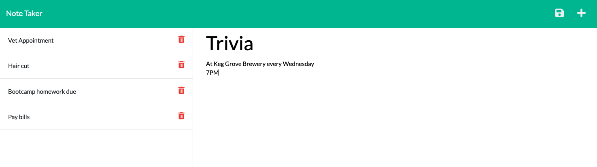

# Homework 11 - Note Take
* Due on 1/14/2022

## Description
* Developed the Express.js backend for a pre-built front end code.  When the application is opened, the user is shown a landing page with a button to create a note.  One clicked, the user is directed to a new page which allows the user to input a note title and note text.  When a title/text is added, a save button appears that when clicked upon the new note is added to a column to the left.  When a note from the left is clicked upon, it will appear within the right side column in larger font.  The user is also able to delete notes if desired.  All submitted notes are saved as JSON. 

## Screen shot of final deployed webpage

## Link to deployed application
